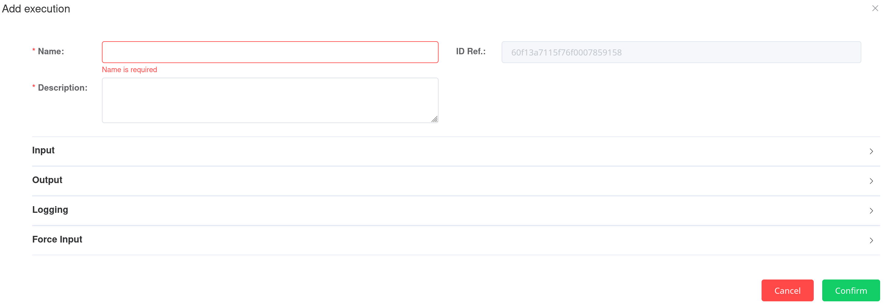

.. _inputs:

INPUTS
=====================================

The PAS model use 3 non-direct inputs, passed to the model by the Operational Tool throught a json call model instance.

.. _pas_instance:

Model Instance
-------------------------------------
To run the PAS model, informations have to be provided, mainly "where to find the inputs?" and "where to export the outputs?".
The detail of those inputs and outputs will be exposed thereafter. The present section focus on the Operational Tools interface that need to be fullfiled in order to execute the PAS model.

    The Operational Tools interface to execute the PAS model.

In the **Input** section, the user provides localisation of the inputs in the Information Hub. That is to say an index and a document id. Some default values are preset, but to use them, user have to actualy store the input in this location.

In the **Output** section, the user provide localisation where the PAS model will export its results in the Information Hub. That is to say an index and a document id. Note that if a document with the same document id is already present in the index, it will be overwrite.

The **Logging** section is similar to the Output one, but dedicated to information about the PAS model run. Those outputs are more contextual informations than actual results.

The **Forceinput** allows to directly provide values for inputs, without using documents in Information Hub. Note that the provided values should mimic the json format of the corresponding documents.

.. note:: For vessel-calls, documents in Information Hub have a specific structure, with actual data inside the field "data". Then when using forceinut for vessel-call data, this structure have to be respected, as illustred here.

  .. code-block:: 
  {
    "forceinput": [
      {
        "name": "vessel_call",
        "value": [
          {
            "data": {
              "name": "a first vessel-call example",
              "departure_dock": 0000,
              "loading_cargo_type": "xxxx",
              "scheduled_departure_dock": 0000,
              "IMO": "xxxx",
              "loading_berth": "xxxx",
              "source": "urn:pixel:DataSource:****:VesselCall",
              "loading_cargo_fiscal_type": "xxxx",
              "journeyid": ****,
              "loading_dangerous": false,
              "unloading_tonnage": 0000,
              "arrival_dock": 0000,
              "unloading_cargo_fiscal_type": "xxxx",
              "loading_tonnage": 0000,
              "unloading_cargo_type": "",
              "unloading_agent": "xxxx",
              "unloading_berth": "xxxx",
              "unloading_dangerous": false,
              "location": {
                  "lat": 0000,
                  "lon": 0000
              },
              "dataProvider": "http://****/vcall",
              "loading_agent": "xxxx"
            }
          },
          {
            "data": {
              "name": "a second vessel-call example",
              "departure_dock": 0000,
              "loading_cargo_type": "xxxx",
              "scheduled_departure_dock": 0000,
              "IMO": "xxxx",
              "loading_berth": "xxxx",
              "source": "urn:pixel:DataSource:****:VesselCall",
              "loading_cargo_fiscal_type": "xxxx",
              "journeyid": ****,
              "loading_dangerous": false,
              "unloading_tonnage": 0000,
              "arrival_dock": 0000,
              "unloading_cargo_fiscal_type": "xxxx",
              "loading_tonnage": 0000,
              "unloading_cargo_type": "",
              "unloading_agent": "xxxx",
              "unloading_berth": "xxxx",
              "unloading_dangerous": false,
              "location": {
                "lat": 0000,
                "lon": 0000
              },
              "dataProvider": "http://****/vcall",
              "loading_agent": "xxxx"
            }
          }
        ]
      }
    ]
  }

.. _vessel_calls:

Vessel-calls
-------------------------------------

.. _port_parameters:

Port's parameters
-------------------------------------

.. _settings:

Settings
-------------------------------------