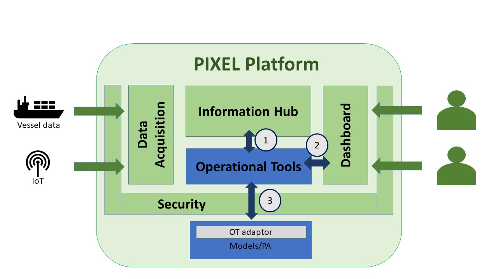
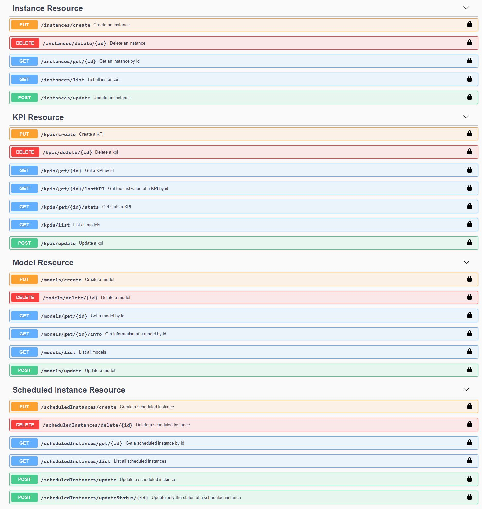

## Identification of interfaces
<div align="justify">

As commented in the **Main concepts and Architecture subsection**, the OT interacts mainly with 3 external entities, as shown in the Figure below:

  - **Interface 1**: This is the interface used by the Operational Tools to obtain information (e.g. eKPIs) from the Information Hub. Here the OT act mainly as user. Therefore, this interface will not be explained in this section, but in the Information Hub chapter as part of the PIXEL documentation.
  - **Interface 2**: This is the main interface used, typically by the **Dashboard**, to **publish en execute models, instances and scheduledInstances, as well as manage KPIs**. This interface is developed as part of the Operational Tools and will be described below as **Management Interface**.
  - **Interface 3**: The Operational Tools are somehow divided into a **main component**, being part of the PIXEL architecture, and also a **OT adaptor** integrated in each of the models and predictive algorithms to allow its integration and management inside the platform. This interface is developed as part of the Operational Tools and will be described below as **Execution Interface**.

<p align="center">

</p>

The Figure below depicts these 3 interfaces from the point of view of the internal blocks of the main components of the Operational Tools. As can be observed, the PIXEL Dashaboard will invoke **Interface 2** to manage the publication and execution of models. The **Engine block** of the OT, whenever a model or predictive algorithm needs to be executed, invokes the corresponding **Docker instance**, which incorporates an OT adaptor component able to understand the exchange of parameters through the **Interface 3**. The **Interface 1** refers to the use of the **Information Hub API** to retrieve information. Storage of information as output of the execution of models and predictive algorithms is done by the **Docker instanc**e by means of the **OT adaptor**. 

<p align="center">

</p>

</div>
<br/><br/>


## Management Interface
<div align="justify">

This specification is intended for service consumers (with development skills). It provides a full specification of how to interoperate with the OT Management Service API.

The API user should be familiar with:
  - RESTful web services
  - HTTP/1.1.
  - JSON data serialization formats.

Users can perform the following actions through the CRUD (Create, Read, Update, Delete) API:
  - Manage **models** (both PIXEL models and predictive algorithms)
  - Manage **instances** (executions of models and predictive algorithms)
  - Manage **scheduled instances** (scheduled executions of models and predictive algorithms)
  - Manage **KPIs** (following the FIWARE KPI data format)

All endpoints require authentication. The **Authorization** HTTP header can be specified with ``ApiKey <your-key>``
to authenticate as a user and have the same permissions that the user itself. Example:

```
GET / HTTP/1.1
Host: ot_host
Authorization: ApiKey <your-key>
```
Once the OT main component is deployed, it provides an Swagger (OpenAPI) endpoint under the path ``http://<your_server>:8080/otpixel/doc/#/`` where you have a Swagger UI to test the API 

<p align="center">

</p>

A complete list of all methods is available as a standalone HTML page [here](ot-api.html), containing examples of code for various programming languages.

<p align="center">

</p>


</div>
<br/><br/>

## Execution Interface
<div align="justify">

TBC
</div>
<br/><br/>

## Software Extensions
<div align="justify">
   
TBC
<br/><br/>

</div>

### Additional notes
<div align="justify">
   
TBC
<br/><br/>

</div>


<a name="instances-put"></a>
##### Create new instance
```
PUT /instances/create
```


###### Parameters

|Type|Description|Schema|
|---|---|---|
|**Body**|Instance configuration|[Model](definitions.md#model)|


###### Responses

|HTTP Code|Description|Schema|
|---|---|---|
|**200**|Instance created successfully|No content
|**400**|Instance already uploaded|No content
|**500**|Internal error|No content

###### Consumes
* `application/json`


### API-Models
<div align="justify">

<br/>
</div>

<a name="model_instance"></a>
##### Instances 

|Name|Description|Schema|
|---|---|---|
|**id**  <br>*optional*| id assigned at creation time|string (uuid)|
|**idRef**  <br>*required*| id of the correspoding model|string (uuid)|
|**name**  <br>*required*|name of the instance|string|
|**description**  <br>*optional*|Description of the instance|string|
|**mode**  <br>*required*|ExecAsync, ExecSync, Subscription|string|
|**user**  <br>*required*|user/user id|string|
|**input**  <br>*required*|input configuration|InstanceInputItem(#model_instanceinputitem)|


<a name="model_instanceinputitem"></a>
##### InstanceInputItem 

|Name|Description|Schema|
|---|---|---|
|**id**  <br>*optional*| id assigned at creation time|string (uuid)|
|**idRef**  <br>*required*| id of the correspoding model|string (uuid)|
|**name**  <br>*required*|name of the instance|string|
|**description**  <br>*optional*|Description of the instance|string|
|**mode**  <br>*required*|ExecAsync, ExecSync, Subscription|string|
|**user**  <br>*required*|user/user id|string|
|**input**  <br>*required*|input configuration|string|


 
