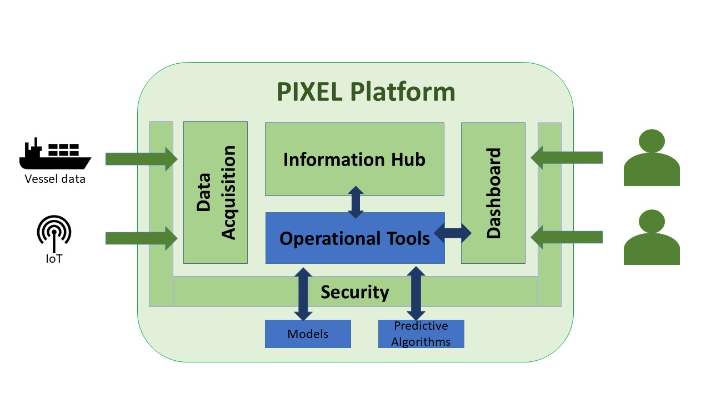
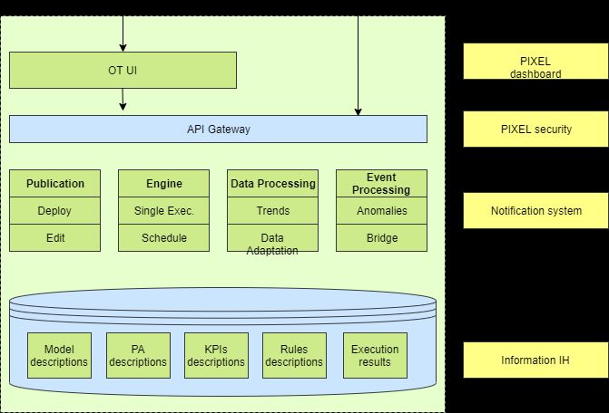
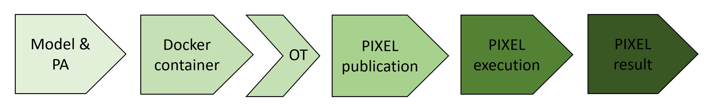

# PIXEL OT Documentation Page 

---

## Overview

This documentation explores in detail the PIXEL Operational Tools as one of the main components of the PIXEL architecture. To access the main documentation repository of PIXEL, click [here](https://pixel-ports.readthedocs.io/en/latest/). To access the PIXEL project website, click [here](https://pixel-ports.eu/).

> *PIXEL is the first smart, flexible and scalable solution for reducing environmental impacts while enabling the optimization of operations in port ecosystems through IoT.*

PIXEL enables a two-way collaboration of ports, multimodal transport agents and cities for **optimal use of internal and external resources, sustainable economic growth and environmental impact mitigation, towards the Ports of the Future**. Built on top of the state-of-the art interoperability technologies, PIXEL centralises data from the different information silos where internal and external stakeholders store their operational information. PIXEL leverages an **IoT based communication infrastructure** to voluntarily exchange data among ports and stakeholders to achieve an efficient use of resources in ports.

PIXEL has been financed by the **Horizon 2020 initiative** of the European Commission, contract 769355.  

  

## Main concepts and Architecture

The Operational Tools (OT) are mainly in charge of bringing closer to the user both the **models and predictive algorithms** developed within the PIXEL project. By user here we mean administrators and managers analysing port operations by means of **simulation models and predictive algorithms**. In order to reach that goal, a set of high-level tasks are defined: 

   - **Publish** models and/or predictive algorithms
   - **Edit** and **configure** the models and/or predictive algorithms
   - **Execute** models and/or predictive algorithms
   - **Schedule** models and/or predictive algorithms to be executed at a **specific time** once or **periodically**
   - **Define** different operational and environmental **Key Performance Indicators (KPIs)**, based on specific data available in the information hub for **tracking and monitoring** purposes
   - Establish some **pattern detection** mechanism. The most basic one is the use of **triggers**. 
   - Get the **trends** of a model and/or predictive algorithm (e.g. historical data)

<!--  -->

The functional overview of the Operational Tools is depicted in the Figure below. Several internal components can be identified:

   - **OT UI**: this is the graphical interface to access (most of) the underlying functionalities. This component provides independence and autonomy, but it can be later integrated as part of the **PIXEL dashboard** to provide a single-entry point for administrators
   - **OT API**: backend API implementing the functionalities needed. This component is aligned with **PIXEL security framework** in order to fulfil all required security policies (e.g. authentication, authorization, etc.)
   - **Publication component**: it allows publishing both models and predictive algorithms. By publishing it may be necessary to deploy the models as **Docker containers**. Besides, the models ‘and predictive algorithms’ configurations can also be edited.
   - **Engine**: this component is responsible for **executing** the different models and predictive algorithms. The execution can be invoked in **real time** or **scheduled**.
   - **Data processing**: it is responsible for managing **trends** from specific data (KPIs) and also for some **internal data adaptations** required.
   - **Event processing**: this component is responsible for **real-time monitoring of indicators** and trigger specific actions depending on previously configured rules. It includes a connector (bridge) to be integrated with an external **notification system**.
   - **Database**: the database includes description of the models and predictive algorithms that can be used, KPI description, rules as well as other configuration and output related parameters necessary for the correct behaviour of the internal building blocks.

<!--  -->

  

## Models

Models are entities in the PIXEL platform than will be used by port administrators to run and simulate models and predictive algorithms with different input parameters. As every model and predictive algorithm is different from each other and has its own specifities, there is a need to homogenize a common abstract model entity to be the internal representation in the PIXEL platform. It encompasses two different types of developments that have been done within the PIXEL project:

   - **Models**: models relate to energy, traffic and environment. A specific model is the Port Environmental Index (PEI). For more information about the models, please check the **PIXEL main documentation repository** by clicking [here](https://pixel-ports.readthedocs.io/en/latest/).
   - **Predicitve algorithms**: predictive algorithms relate to estimating time of arrival in ports, traffic at gates and use of AIS data. For more information about the models, please check the **PIXEL main documentation repository** by clicking [here](https://pixel-ports.readthedocs.io/en/latest/).

The Figure below shows the process experienced by any model or predictive algorithm that is going to be used inside the PIXEL platform:

- The model or predictive algorithm is first drafted as algorithm and **implemented as program**.
- The model is encapsulated into a **Docker container** to convert it into a portable component. Additionaly, an OT adaptor is attached to his Docker container in order to be integrated into the PIXEL platform.
- Through the **publication process** the model or predictive algorithm becomes aware into the PIXEL platform. The **Docker image** is pulled from the (open) github repository and can be used internally.
- After published, the model or predictive algorithm can be **executed** by passing the appropiate arguments (parameters) as JSON file. The description of this JSON file will be described in future sections. The execution can **run immediately** (real time) or it can be **scheduled** to be performed periodically (e.g. every day or week).
- The **results** of the model are stored into the **PIXEL Information Hub**, which can be queried by the **PIXEL dashboard** to visualize them in form of particular graphs depending on the model or predictive algorithm. 

<!--  -->

  

## KPIs

TBC (TODO)

## Event Processing

TBC (TODO)

 
