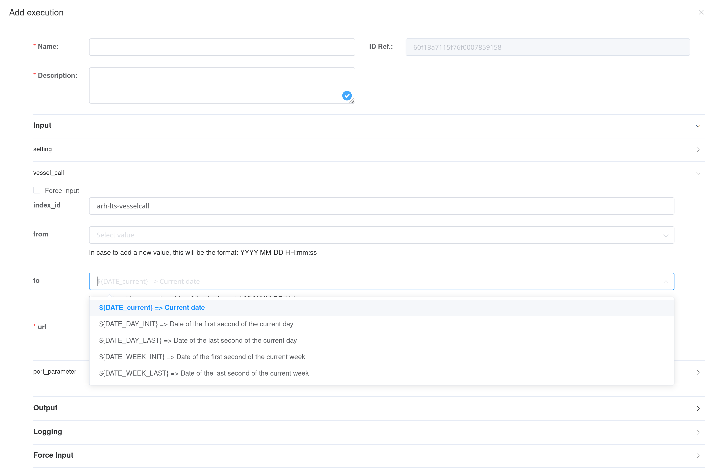
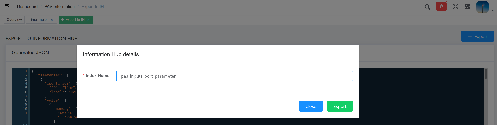

# Inputs

## OT call to the PAS model
The present section focus on the Operational Tools interface that need to be fulfilled in order to execute the PAS model.
To run the PAS model, informations have to be provided, mainly "where to find the inputs?" and "where to export the outputs?". Through a json named model instance, the Operational Tool pass to the PAS model informations to retrieve inputs et export outputs ([see OT documentation](https://docs-hub-ot.readthedocs.io/en/latest/ot_framework/)).

||
|:--:|
|The OT interface to execute the PAS|

In the **Input** section, the user provides localization of the inputs in the Information Hub. That is to say an index and a document id. Default values are preset, but to use them, user have to actually store the input in those locations.

In the **Output** section, the user provide localization where the PAS model will export its results in the Information Hub. That is to say an index and a document id. Note that if a document with the same document id is already present in the index, it will be overwrite.

The **Logging** section is similar to the Output one, but dedicated to information about the PAS model run. Those outputs are more contextual informations than actual results.

The **Forceinput** allows to directly provide values for inputs, without having the corresponding documents in Information Hub. The provided values should mimic the json format of the corresponding documents (for a set of document, use an list of object like `"value":[{doc 1 content}, {doc 2 content}]`.

------

Using distinct index and doc_id allows to run multiple PAS model in paralleled for distinct purpose ([see section Uses](./overview/overview.md#Uses)), or even distinct version of the PAS model.

------

## Vessel-calls

Vessel calls are information about vessels calling at the port to load or unload cargo. A vessel-call can contains distinct cargo unloading and loading. Each will be decompose by the PAS model as "handling". As an example, if a vessel-call point to unload X tons of cargo A and load Y tons of cargo B, it will be converted to 2 handlings. The first handling correspond to unload X tons of cargo A, the second handling correspond to load Y tons of cargo B, both can have distinct vessel docking area.

### Overview
Inside a `"data"` field, a vessel-call document contains the fallowing fields:

| Name | Required | Relate to | Illustrative value(s) |
| -- | -- | -- | -- |
| name | No | Vessel | "Titanic" |
| IMO | No | Vessel | 1131428 |
| journeyid | No | Vessel | "2021072015423tit" |
| (un)loading_bert | Yes | Docking | dock_42 |
| arrival_dock | Yes | Docking | 1626776488 (epoch second), 1626776488000 (epoch millisecond), "1921-07-20T10:23:02" (ISO 8601) |
| departure_dock | Yes | Docking | 1626776488 (epoch second), 1626776488000 (epoch millisecond), "1921-07-20T10:23:02" (ISO 8601) |
| (un)loading_cargo_type | Yes | Content | "corn", "cars", "chopped wood" |
| (un)loading_cargo_fiscal_type | No | Content | "cereal" |
| (un)loading_dangerous | Yes | Content | true, false |
| (un)loading_tonnage | Yes | Content | 31415 |

NB 1: (un)loading_ can figure both loading_ or unloading_

NB 2: for arrival_dock and departure_dock, [see corresponding option in Settings](#Timestamp-format)

------

Currently the PAS model focuses on the loading and unloading of ships. But it is possible to extend it to the loading and unloading of other vehicles such as trucks, river barges or trains, even to monitor transfer of goods between storage areas.

------

The current format of the vessel call data is inherited from the first port that provided data. This format is peculiar in that it mixes various information in an arbitrary manner. To make the PAS model work on raw data in a different format, a port can incorporate into the PAS model a vessel-call conversion module (from its own raw format to the format expected by the PA model).

------

### IH and GUI

Each vessel-calls are stored as distinct documents in Information Hub. To run the PAS model, the index containing vessel-calls have to be provided (usually "arh-lts-vesselcall"). 

#### Filtering on date

All VCs in this index will be use, except if dates are provided for filtering purpose. Then the VCs would be filtered to restrict to the one present inside the port after a starting date and/or before an end date. The date format is ISO 8601. The OT provides a GUI for this purpose, as show in figure X

| |
| -- |
| The OT GUI for VCs filtering on date (with optional automatic date identification) |

#### Passing VCs in forceinput 

When using forceinput for vessel-call data, the fallowing structure have to be respected:

```json
{
     "forceinput": [
         {
             "name": "vessel_call",
             "value": [
                 {
                     "data": {
                        ...(first vessel-call)...
                     }
                 },
                 {
                     "data": {
                         ...(second vessel-call)...
                     }
                 }
             ]
         }
    ]
}
```

## Port's parameters

The port's parameters describes resources (machines, areas, content-types, energies, pollutants), process (supply-chains, timetables) and their assignation to vessel-calls. 

### Overview

An extensive description can be found in [the corresponding json-schema](https://gitpixel.satrdlab.upv.es/Erwan/pas_modelling/src/master/SAMPLES/inputs/UPP_schema.json) (with details for each field, such as textual description, allowed type and example values). 

------

From PAS model point of view, required items are Machines, Areas, Supply-chains and Content-types. Optional items are Time-table, Pollutants and Energies. However, in the graphical interface from the dashboard, to create some required items, optional items may have to be created previously. Thus when created from the graphical interface, all items can be considered as required (even with empty values).

------

The port's parameter

| Name| Required | Use| Main sub-fields|
| - | - | - | - |
| Time tables | No | Assign working hours to resources | For each day of the week, start and end of working hours |
| Pollutants | No | Extend the default pollutants tracked if additional data regarding them can be provide in other entries (such custom emission factors for machines). Furthermore, the alert threshold allows to identify over-emission situation. <br />Note possible partial overlap with default preset for PEI calculation | General description, Alert threshold |
| Energies | Yes | Track energy use in port. Optionally, default emission-factors can be assigned to machines using this energy. Furthermore, the alert threshold allows to identify over-consumption situation. <br />Note possible partial overlap with default preset for PEI calculation | General description, Alert threshold, Emission-factors (pollutant ID and value) |
| Machines | Yes | Characterizes machines available in port. For non-differentiated (interchangeable) machines, the characteristics are described only once, but the number of available items is specified.<br />Note that a set of different machines can be describe as an unique machine. And conversely, a machine can be decomposed into its sub-elements | General description, Use costs, Throughputs, Energy consumption, Pollutants emission factors (if custom values) |
| Area | Yes | Characterizes areas available in port. | General description, Use costs, Energy consumption, Geographical coordinates |
| Supply chains | Yes | Characterizes operations that have to be achieved to process the cargo handling. Equivalent to a Gantt (forward schedule), operations can have complex dependencies between them | General description and list of operations (for each, resources used and the conditions that trigger operation start or end) |
| Content type | Yes | Characterizes content of vessel-call (cargoes, passengers, containers) handled in the port. For each, a set of rules to associate it with the proper supply-chain. The assignation rules can also involve direction, docking area or amount of cargo | General description and list suitable supply-chains (with corresponding sub-rules) |

### IH and GUI

The whole set is stored as an unique document in the Information Hub. The localization of the document (index & doc_id), or a forced value, is required to run the PAS model. An interface is proposed to edit the port's parameters ("PAS information" in the navigation panel, see figure X). 

|  |
| ------------------------------------------------------------ |
| The graphical interface to edit port's parameters. |

This interface exports the created document in an index designed by user (default *pas_inputs_port_parameter*), with a random doc_id. This doc_id must be specified to run the model.

|  |
| ------------------------------------------------------------ |
| The graphical interface allows to export port's parameters into IH to a designed index (but to a random doc_id) |

## Settings

### Overview

PAS model have options that can be turn on or off (e.g. delay handling if overload a specific type of resource) or customized (e.g. time resolution for scheduling or outcomes calculation). This is set through the settings document. Each module have its entry on this document. The most remarkable are listed below. 

#### Pipeline

This global setting list the sequence of modules that will be run. Turning off some module can speed up the running time, and lower required inputs. Such deep control on PAS model behavior require good understanding of the PAS model internal functioning.

#### Handling converter

```json
"handling_converter": {
    "TS_format": "epoch_miliseconde",
    "filters": {
        "ET_consistency": true,
        "content_amount": true,
        "content_type": true,
        "handling_direction": true,
        "handling_dock": true,
        "stopover_ETA": true
    }
}
```

**TS_format** Used to specify the timestamps format used inside VCs. Indeed, depending of the port IT infrastructure, VCs may have different format for `arrival_dock` and `departur_dock`, the proper one have to be specified here. The PAS model can handle 3 formats :

| `TS_format` value | Suitable for |
| -- | -- |
| epoch_second | 1620097321 or "1620097321" |
| epoch_miliseconde | 1620097321123 or "1620097321123" |
| iso8601 | "2021-05-04T03:02:01.00" or "2021-05-04T03:02:01.00Z" or "2021-05-04T03:02:01.00 +02:00" (or several similar string) |

**filters** The tolerance level of the filter of the handlings designated as "aberrant" can be modulated through the content of the field `filter` . The 6 filters can independently be turned on (more coercive) or off (less coercive).

#### Handling assignment

```json
"handling_assignment": {
        "default_SC": false,
        "discart_unassigned": true,
        "restrictions": {
            "amount_max": false,
            "amount_min": false,
            "direction": false,
            "dock": false
    }
}
```

**default_SC** If true, for handling with no supply-chain explicitly suitable, try to force assign a default one (if available). 

**discart_unassigned** If false, handlings without supply-chain explicitly suitable are discarded.

**restrictions** To manage handling assignment to the correct supply-chain, the main parameters is the content-type involved (e.g. corn, cars, chopped wood). But this is refined with sub-rules. Here those sub-rules can be globally dis-activated.

#### Handling delayer

```json
"handling_delayer": {
    "time_resolution": 15,
    "constraints_activation": {
        "areas capacity": true,
        "machines availability": true
    }
}
```


**time_resolution** The time duration in minutes that is used to discretize the time dimension during scheduling process

**constraints_activation** When an activity to process an handling requires more resources than available at that time, the activity is identified with the status "overloading". Handling with activity overloading can be re-scheduled to avoid any overloading. Currently, two constraint are available. If `areas capacity` is turned on, the global schedule (all handlings) will avoid having more operators in an area than its capacity. If `machines avilability` is turned on, the global schedule (all handlings) will avoid having more instance of any machines than available.

#### Machine auto emission factor

This settings contains references for pollutants emissions calculation, then PEI calculation. It allows to assignee emission factors to machines.

### IH and GUI

There is no GUI available to edit settings, that have to be edited manually and pushed in IH. For settings, the default index is `pas_inputs_settings` and the default doc_id `default_settings`. For user convenience, typical set of settings are provided [here](https://gitpixel.satrdlab.upv.es/Erwan/pas_modelling/src/master/SAMPLES/inputs/settings).