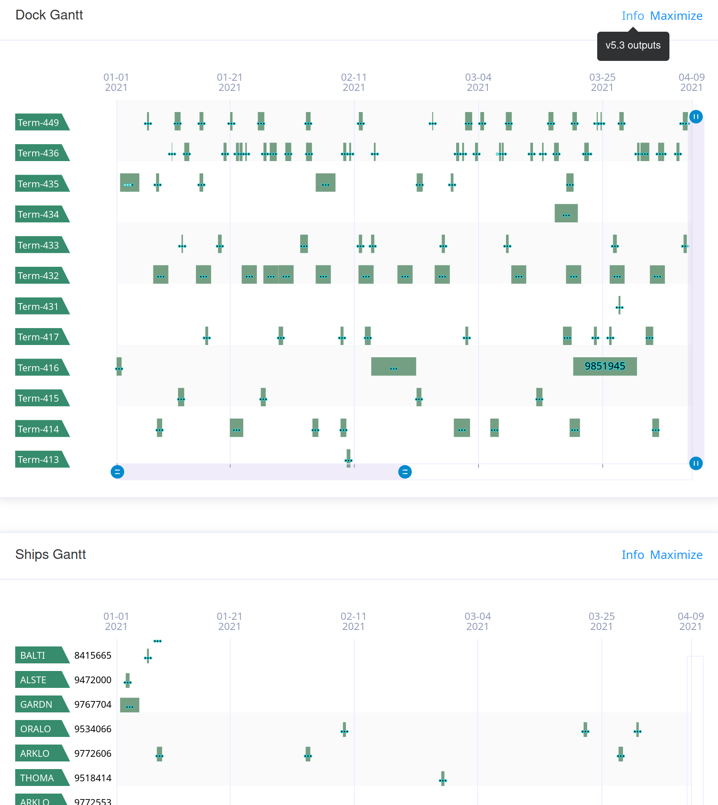
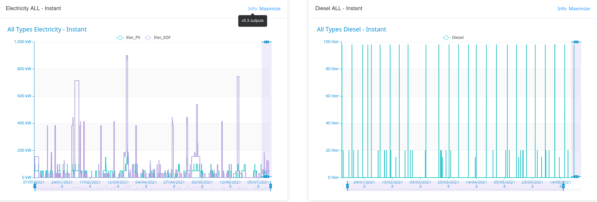
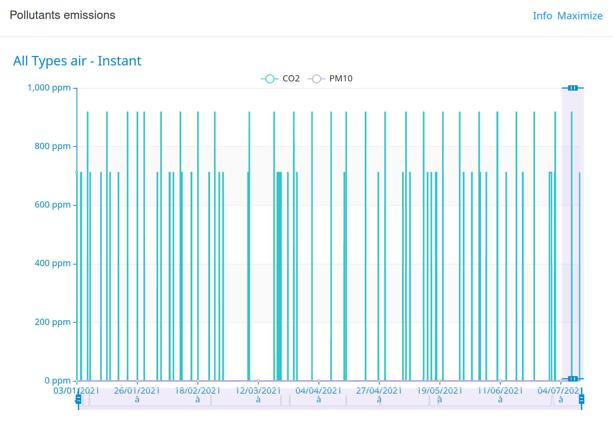

# Outputs
The PAS model produces several outputs, which can be classified into two groups, the intended results and the context information.

--------------------------
The table X list all PAS model outputs exported in IH and their default location.

| Item | Default index | Default doc_id |
| -- | -- | -- |
| Scenario | pas_outputs_results | default_handlings |
| Gantts views | pas_outputs_results | default_gantt_view |
| Resources uses | pas_outputs_results | default_resource_use |
| Energy consumptions | pas_outputs_results | default_energies_consumptions |
| Areas occupancy | pas_outputs_results | default_areas_occupancy |
| Pollutant emissions | pas_outputs_results | default_pollutants_emissions |
| Logs | pas_outputs_loggings | default_logs |
| Port parameters | pas_outputs_loggings | default_port_parameters |
| OT call | pas_outputs_loggings | default_ot_call |
| Settings | pas_outputs_loggings | default_settings |

--------------------------
All output have a json structure, with key information in `info` and actual data in `data`

```
{
    "info": {
        "url": null,
        "index": "pas_outputs_results_5.3",
        "doc_ID": "default_area_occupancy",
        "creation_TS": "2021-07-21T13:04:43"
    },
    "data": {...}
}

```


## Results

### Scenario
The scenario provide for each handling the list of activities in the port to process it. Activities correspond to atomic operations described in supply-chains. Briefly, for each activity is provided:
- a general description,
- its scheduling (start, duration, end),
- resources it require (machines, areas, operators).

Furthermore, depending on outcome modules activated (settings), additional information can be added to each resource used, such as:

- energy consumption (nature, quantity),
- pollutant emission (nature, quantity).

The scenario is actually the outcome with the highest density of information. Schematically, others results are specific views of the scenario, simplified by isolating a specific information dimension.

--------------------------
Currently, there is no user friendly interface available on pixel platform for this output.

### Resources uses
For respectively all machines and areas from the `port parameters`, gives:

- its global use time series - for each timestamp, number of machine instance or operators in the area,
- its maximal capacity - an activity that would require going above this threshold would have its status equal to overload or would be delayed,
- the detail of its uses - pointing for each handling that required this resource, the corresponding activity, the timestamps and quantity required.

--------------------------
Currently, there is no user friendly interface available on pixel platform for this output.

### Gantts views
This output contains data to plot to Gantt graphs, allowing to see:
- handlings sequence from:
    - docks view,
    - ships view,
    - agents view,
    - content-type view,
    - supplychaines view,
- activities sequence from:
    - handlings view,
    - areas view,
    - machines view,

As an example, activities:machines view mean to plot all machines on Y axis and time on X axis. A succession of horizontal rectangles represents activities using the machine y between x_i and x_j (optionally colored according to their status: ok, hs, overload, delayed).

| |
| -- |
|A graphical tool is available to display 2 of the available views (handlings:dock view and handlings:ships view).|


### Energy consumptions
This output contains data to plot all energy consumption in port across time.
Optionally, status with respect to energy threshold could be added.

| |
| -- |
|A graphical tool is available to display energy consumption (both instantaneous and cumulative) for a given energy category.|

### Area occupancy
This output contains data to plot the number of operators in the areas, with additional information with respect to its maximal countenance.

--------------------------
For this output, a graphical tool is available to display areas occupancy.

### Pollutant emissions
This output contains data to plot all energy consumption in port across time.
Optionally, status with respect to energy threshold could be added.

| |
| -- |
|A graphical tool is available to display pollutant emission (both instantaneous and cumulative) for a given pollutant category.|

## Loggings
Those outputs are contextual information. They can be used to explain the results, or ensure information storage to reproduce identical PAS model run context (useful to compare scenario).

### Logs
A first section resume most important informations about the PAS model run. All modules list their critica message (if any) and sumary of their actions.
A second section displays all the information, in an exhaustive way, in the order of appearance of the elements.

--------------------------
Currently, there is no user friendly interface available on pixel platform for this output.

### Port Parameters
The content of the `port_parameter` used by the PAS model. This corresponds to the original value (from document or forced input) plus several modifications, like adding automatically calculated emission factors to the machines.

### OT call
The content of the `model instance` send by the OT to the PAS model. This corresponds to the original value (from document or forced input) without modifications.

### Settings 
The content of the `setting` used by the PAS model. This corresponds to the original value (from document or forced input) without modifications.