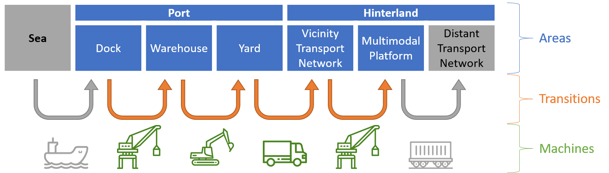

# PAS overview

## What : PAS concept
This model of the PIXEL platform aims to allows user to convert raw data into actionable information.

| 
|:--:|
| Illustration of the basic operating principle of the PAS

Firstly, the model build the Port's Activities Scenario (PAS). This mean to elucidate the required activities in port to handle cargoes in port (e.g. unload from vessel to warehouse storage). For each of the activities, the scenario precise **what** are the goods, **when** does it occurs and **how** (resources and process used).

| 
|:--:|
| The purpose of the PAS is to identify and schedule the activities required in the port to process cargoes

Secondly, from the PAS can be calculate outcomes, likes **energy consumption**, **pollutant emission**, or **area occupancy**. From these primary metrics, secondary metrics could be derived, such as utilization rate, energy efficiency, or the existence of bottlenecks.

## Why: PAS uses
Considering a list of vessel-calls to handle, a set of port's parameters and several options ([see Inputs section](../inputs/inputs.md)), the model aims to establish the required activities in port (among other [see Outputs section](../outputs/outputs.md)).
Depending on the type of data provided as input, four use can be proposed, as show in table X

| Input data                                                   | Use case   |
| ------------------------------------------------------------ | ---------- |
| Live stream (e.g. IoT)                                       | Monitoring |
| Consolidated historical (e.g. invoices & registers)          | Assessment |
| Estimated future (e.g. predictive algorithms)                | Forecast   |
| « What if » scenario (e.g. change a machine, traffic evolution) | Explore    |

## How: run the PAS model
The model can be use by itself, considering it receive a proper model_instance ([see section OT call to the PAS model](../inputs/inputs.md#OT-call-to-the-PAS-model)). But is mean to be deployed in PIXEL platform thought a Docker image.

From python (requirements available in `./pipfile`):
`PAS_model.py --from_file "path/to/pas_instance.json"`

From docker:
`docker build -t pas_model -f ./DOCKERISE/Dockerfile .`
`docker run pas_model python3 PAS_model.py {mode_instance}`

<!-- ## Features -->

<!-- **Functional**
- Create scenario for handlings
- Create outcomes "views":
    - energy consumptions
    - area occupancies
    - pollutant emissions
- Allows several timestamp formats in vessel-call 

**In progress**
- Delay handlings for ressources constraints
- Outcomes updates:
    - add "gost" records with value = 0
    - post calculation (aggregated (e.g. sum, mean etc) or normalized (e.g. quantity/ton).)

**Standby**
- priority order
- non-cargo (unloading or full load)
- consumption supports :
    - refrigerated containers
    - lights
    - buildings -->
