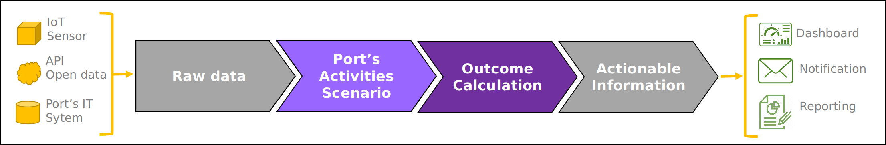

# PAS model overview

## What is it
This model of the PIXEL platform aims to allows user to convert raw data into actionnable information.

| 
|:--:|
| Illustration of the PAS model core principes

Firstly, the model build the Port's Activities Scenario (PAS). This mean to elucidate the required activities in port to handle cargo between vessels and yard.For each of the activities, the scenario precise **what** are the resouces used, **when** does it occur they occur and **where** in the port.

| 
|:--:|
| The PAS model aims to figures and schedule required activities in port to handle vessel-calls

Secondly, from the PAS can be calcul outcomes, likes **energy consumption**, **pollutant emission**, or **area occupancy**. From these primary metrics, secondary metrics could be derived, such as utilization rate, energy efficiency, or the existence of bottlenecks.

## How to use it
Considering a list of vessel-calls to handle, a set of port's parameters and several options (:ref:`inputs`), the model aims to establish the required activities in port (among other :ref:`outputs`).
Depending on the type of data provided as input, four use can be identified, as show in table :ref:`table_toto`

.. list-table:: The PAS model uses
  :widths: 50 50
  :header-rows: 1

  * - Input data 
    - Use case
  * - Live stream
    - Monitoring
  * - Consolidated historical
    - Assessment
  * - Estimated future	
    - Forecast
  * - « What if » scenario	
    - Explore